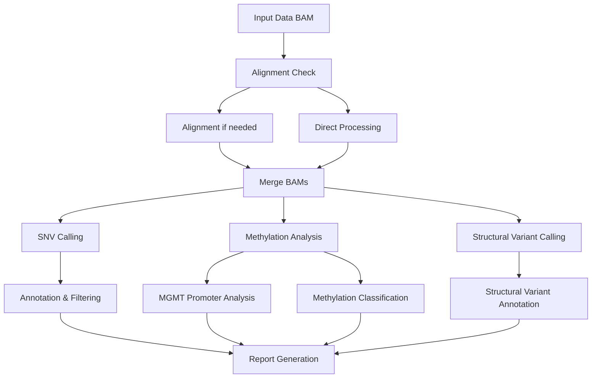

<div align="left">


<h1 style="display: inline-block;">Rapid-CNS<sup>2</sup> workflow</h1>
</div>

## Overview

The Rapid-CNS<sup>2</sup> nextflow pipeline is a bioinformatics workflow designed for comprehensive analysis of genomic and epigenomic data generated using adaptive sampling based sequencing of central nervous system (CNS) tumours. It performs tasks such as alignment, SNV calling, structural variant calling, methylation analysis, copy number variation calling, and provides a comprehensive molecular report.

This pipeline is implemented using Nextflow, allowing for easy execution and scalability on various compute environments, including local machines, clusters, and cloud platforms.

## Features

- **Modular architecture** for easy customization and extension
- **Flexible input handling** - supports aligned and unaligned BAM files with automatic alignment detection
- **Accelerated variant calling** with Clara Parabricks supported DeepVariant and Sniffles2
- **Comprehensive analysis** including methylation analysis with Rapid-CNS² classifier and MGMT promoter methylation status
- **Automated reporting** with molecular diagnostic-ready reports
- **MNP-Flex integration** for additional classifier input preparation (optional)

## Requirements

- **Nextflow:** version 20.10.0 or later (recommended 22.10.0+)
- **Container Engine:** Docker (recommended) or Singularity
- **Java:** OpenJDK 8 or later
- **System:** Linux (Ubuntu 18.04+, CentOS 7+, or similar)
- **Memory:** Minimum 8GB RAM, recommended 32GB+ for large datasets
- **Storage:** At least 100GB free space for reference genomes and databases

## Quick start

### 1. Clone the repository
```bash
git clone https://github.com/areebapatel/Rapid-CNS2_nf.git
cd Rapid-CNS2_nf
```

### 2. Install dependencies

#### Install Nextflow
```bash
# Using Conda (recommended)
conda create -n nextflow python=3.9
conda activate nextflow
conda install -c bioconda nextflow

# Or manual installation
curl -s https://get.nextflow.io | bash
sudo mv nextflow /usr/local/bin/
```

#### Install container engine
```bash
# Docker (recommended)
curl -fsSL https://get.docker.com -o get-docker.sh
sudo sh get-docker.sh
sudo usermod -aG docker $USER

# Or Singularity
sudo apt-get update
sudo apt-get install -y singularity-container
```

### 3. Download reference genome
```bash
# Create reference directory
mkdir -p /path/to/references/hg38

# Download UCSC hg38 reference genome
wget https://hgdownload.soe.ucsc.edu/goldenPath/hg38/bigZips/hg38.fa.gz
gunzip hg38.fa.gz
mv hg38.fa /path/to/references/hg38/hg38.fa

# Create index files
samtools faidx /path/to/references/hg38/hg38.fa
```

### 4. Install ANNOVAR

ANNOVAR is required for variant annotation:

1. **Register and download:**
   - Visit [ANNOVAR Download Form](https://www.openbioinformatics.org/annovar/annovar_download_form.php)
   - Fill out the registration form with your institutional email
   - Download the package from the link sent to your email

2. **Install and setup:**
```bash
# Extract ANNOVAR
tar -xzf annovar.latest.tar.gz
cd annovar
chmod +x *.pl

# Create humandb directory and download databases
mkdir humandb/
./annotate_variation.pl -buildver hg38 -downdb -webfrom annovar refGene humandb/
./annotate_variation.pl -buildver hg38 -downdb -webfrom annovar cytoBand humandb/
./annotate_variation.pl -buildver hg38 -downdb -webfrom annovar clinvar_20240917 humandb/
./annotate_variation.pl -buildver hg38 -downdb -webfrom annovar avsnp151 humandb/
./annotate_variation.pl -buildver hg38 -downdb -webfrom annovar 1000g2015aug humandb/
./annotate_variation.pl -buildver hg38 -downdb -webfrom annovar cosmic70 humandb/
./annotate_variation.pl -buildver hg38 -downdb -webfrom annovar dbnsfp42c humandb/
./annotate_variation.pl -buildver hg38 -downdb -webfrom annovar allofus humandb/
```

**Note:** ANNOVAR is freely available for personal, academic, and non-profit use only. Commercial users must purchase a license from [QIAGEN](https://digitalinsights.qiagen.com/).


### 6. Configure the pipeline

Edit the `nextflow.config` file with your system-specific paths:

```groovy
params {
    // Update these paths to match your system
    ref = "/path/to/references/hg38/hg38.fa"
    annovarPath = "/path/to/annovar/"
    annovarDB = "/path/to/annovar/humandb/"
    annotsvAnnot = "/path/to/AnnotSV/Annotations_Human/"
}
```

### 7. Run the pipeline

#### Basic run
```bash
nextflow run main.nf \
    --input /data/sample.bam \
    --id SAMPLE001 \
    --outDir ./results \
    -profile lsf
```

#### Advanced run
```bash
nextflow run main.nf \
    --input /data/sample.bam \
    --id SAMPLE001 \
    --patient "John Doe" \
    --outDir ./results \
    --minimumMgmtCov 10 \
    --mnpFlex true \
    --runHumanVariation true \
    --containerEngine singularity \
    -profile slurm
```

## Input requirements

### Sequencing requirements

**⚠️ IMPORTANT: This pipeline is specifically designed for Oxford Nanopore Technologies (ONT) data generated using adaptive sampling with the gene panel described in Patel et al. 2022 and Patel et al. 2025.**

- **Platform:** Oxford Nanopore Technologies (MinION, GridION, PromethION)
- **Sequencing Method:** Adaptive sampling with targeted gene panel
- **Gene Panel:** NPHD panel (160 gene regions) as described in:
  - Patel et al. (2022). Rapid-CNS²: rapid comprehensive adaptive nanopore-sequencing of CNS tumors. *Acta Neuropathologica* 143, 609–612
  - Patel et al. (2025). Prospective, multicenter validation of a platform for rapid molecular profiling of central nervous system tumors. *Nature Medicine* 31, 1567–1577

**⚠️ NOT SUITABLE FOR:**
- Shallow whole genome sequencing (WGS)
- Other sequencing platforms (Illumina, PacBio, etc.)
- Non-targeted sequencing approaches

**⚠️ WGS WARNING:**
If using whole genome sequencing data, the average coverage should be at least **10X** for reliable reporting of variants. Lower coverage may result in:
- Reduced sensitivity for variant detection
- Increased false negative rates
- Unreliable methylation analysis
- Poor MGMT promoter methylation assessment

### Basecalling

**Basecalling must be performed externally.**
- Use [epi2me-labs/wf-basecalling](https://github.com/epi2me-labs/wf-basecalling) or Dorado directly
- Ensure you use a model that supports modified basecalling (see [Dorado documentation](https://github.com/nanoporetech/dorado?tab=readme-ov-file#modified-basecalling))
- Provide the resulting BAM(s) as input to this pipeline

### Input options

The pipeline accepts:
- **(Preferred) Single aligned BAM file:** Direct path to a single aligned and merged BAM file (e.g., `/path/to/sample.bam`)
- **Directory with aligned BAM files:** Path to directory containing multiple aligned BAM files (will be merged automatically)
- **Directory with unaligned BAM files:** Path to directory containing multiple unaligned BAM files (will be aligned and merged automatically)

## Pipeline structure



## Parameters

### Required parameters

| Parameter | Description | Example |
|-----------|-------------|---------|
| `--input` | **Required.** Path to input BAM file(s). Can be:<br>• Single aligned BAM file: `/path/to/sample.bam`<br>• Directory with aligned BAMs: `/path/to/aligned_bams/`<br>• Directory with unaligned BAMs: `/path/to/unaligned_bams/` | `--input /data/sample.bam` |
| `--id` | **Required.** Unique sample identifier used for naming output files and reports. Should be alphanumeric with no spaces. | `--id SAMPLE001` |

### System-specific parameters

**These parameters must be configured for your specific system and installation paths in the nextflow.config file:**

| Parameter | Description | Default | Example |
|-----------|-------------|---------|---------|
| `--ref` | Path to hg38 reference genome FASTA file | System-specific | `--ref /refs/hg38.fa` |
| `--annovarPath` | Path to ANNOVAR installation directory. | System-specific | `--annovarPath /tools/annovar/` |
| `--annovarDB` | Path to ANNOVAR database directory (humandb/). | System-specific | `--annovarDB /tools/annovar/humandb/` |
| `--annotsvAnnot` | Path to AnnotSV annotations directory. | System-specific | `--annotsvAnnot /tools/AnnotSV/Annotations_Human/` |
| `--annotations` | Path to annotation file for IGV reports (refGene.txt.gz). | `data/refGene.txt` | `--annotations /refs/refGene.txt` |


### Optional parameters

#### Output parameters

| Parameter | Description | Default | Example |
|-----------|-------------|---------|---------|
| `--outDir` | Output directory for all pipeline results. Will be created if it doesn't exist. | `output` | `--outDir /results/analysis` |
| `--tmpDir` | Directory for temporary files. Auto-set to `${outDir}/tmp/` unless overridden. | `${outDir}/tmp/` | `--tmpDir /scratch/tmp` |
| `--logDir` | Directory for log files. | `logDir` | `--logDir /logs` |
| `--patient` | Patient name for reports. If not specified, uses the `--id` value. | `null` (uses `--id`) | `--patient "John Doe"` |

#### Resource parameters

| Parameter | Description | Default | Example |
|-----------|-------------|---------|---------|
| `--maxThreads` | Maximum number of threads for general processes. | `64` | `--maxThreads 32` |
| `--modkitThreads` | Number of threads for modkit methylation calling. | `32` | `--modkitThreads 16` |
| `--cnvThreads` | Number of threads for CNVpytor copy number analysis. | `32` | `--cnvThreads 16` |
| `--snifflesThreads` | Number of threads for Sniffles2 structural variant calling. | `32` | `--snifflesThreads 16` |
| `--snpThreads` | Number of threads for SNV calling with DeepVariant. | `64` | `--snpThreads 32` |
| `--svThreads` | Number of threads for structural variant calling. | `64` | `--svThreads 32` |
| `--covThreads` | Number of threads for coverage calculation with mosdepth. | `8` | `--covThreads 4` |
| `--methThreads` | Number of threads for methylation classification. | `64` | `--methThreads 32` |
| `--mgmtThreads` | Number of threads for MGMT promoter analysis. | `8` | `--mgmtThreads 4` |

#### Analysis parameters

| Parameter | Description | Default | Example |
|-----------|-------------|---------|---------|
| `--minimumMgmtCov` | Minimum coverage threshold for MGMT promoter methylation analysis. If coverage is below this threshold, MGMT analysis will be skipped. | `5` | `--minimumMgmtCov 10` |
| `--bamMinCoverage` | Minimum coverage threshold for human variation workflow. | `10` | `--bamMinCoverage 15` |
| `--mnpFlex` | Enable MNP-Flex classifier input preparation. Creates files needed for external MNP-Flex analysis. | `false` | `--mnpFlex true` |
| `--runHumanVariation` | Enable wf-human-variation SNP and SV pipeline. Adds additional variant calling workflows. | `false` | `--runHumanVariation true` |

#### Container and system parameters

| Parameter | Description | Default | Example |
|-----------|-------------|---------|---------|
| `--containerEngine` | Container engine to use: 'docker' or 'singularity'. | `docker` | `--containerEngine singularity` |
| `--seq` | Sequencer platform identifier. Auto-detected from BAM headers, but can be manually set. | `P2` | `--seq F` |

### Profile-specific parameters

The pipeline supports different compute infrastructure profiles:

#### LSF profile (`-profile lsf`)
- **Executor:** LSF
- **Queue:** normal
- **Memory:** 8 GB per process
- **CPUs:** 2 per process
- **GPU:** Available for variant calling and structural variant processes

#### SLURM profile (`-profile slurm`)
- **Executor:** SLURM
- **Queue:** batch
- **Memory:** 8 GB per process
- **CPUs:** 2 per process
- **GPU:** Available for variant calling and structural variant processes

#### Local profile (`-profile local`)
- **Executor:** Local
- **Memory:** 4 GB per process
- **CPUs:** 1 per process
- **GPU:** Not available

## Output

The pipeline generates comprehensive outputs in the specified output directory:

- **SNV analysis:** Variant calls, annotations, and filtered reports
- **Structural variants:** SV calls with annotations
- **Copy Number variations:** CNV analysis with plots and annotations
- **Methylation analysis:** Methylation calls and classification results
- **MGMT analysis:** Promoter methylation status and predictions
- **Coverage analysis:** Depth of coverage summaries
- **Reports:** HTML reports with comprehensive molecular diagnostic information

## Troubleshooting

### Common Issues

1. **Java not found:**
   ```bash
   sudo apt-get install openjdk-11-jdk
   ```

2. **Docker permission denied:**
   ```bash
   sudo usermod -aG docker $USER
   # Log out and log back in
   ```

3. **Nextflow cache issues:**
   ```bash
   nextflow clean -f
   ```

4. **Memory issues:**
   - Increase Java heap space: `export NXF_OPTS="-Xms500M -Xmx2G"`
   - Reduce the number of concurrent processes in `nextflow.config`

### Getting Help

- Check the Nextflow documentation: https://www.nextflow.io/docs/
- Review the pipeline logs in the `work/` directory
- Check the `pipeline_info/` directory for execution reports
- Run with `--help` for available options

## Citation

If you use this pipeline, please cite our work:

Patel, A., Göbel, K., Ille, S. et al. Prospective, multicenter validation of a platform for rapid molecular profiling of central nervous system tumors. *Nature Medicine* 31, 1567–1577 (2025). [https://doi.org/10.1038/s41591-025-03562-5](https://www.nature.com/articles/s41591-025-03562-5)

## License

This project is licensed under the [MIT License](LICENSE).

[](LICENSE)
[](https://www.nextflow.io/)