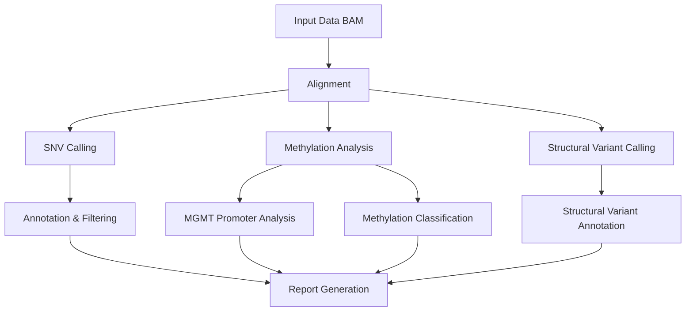

<div align="left">


<h1 style="display: inline-block;">Rapid-CNS<sup>2</sup> workflow</h1>
</div>

## Overview

The Rapid-CNS<sup>2</sup> nextflow pipeline is a bioinformatics workflow designed for comprehensive analysis of genomic and epigenomic data generated using adaptive sampling based sequencing of central nervous system (CNS) tumours. It performs tasks such as alignment, SNV calling, structural variant calling, methylation analysis, copy number variation calling, and provides a comprehensive molecular diagnostic-ready report.

This pipeline is implemented using Nextflow, allowing for easy execution and scalability on various compute environments, including local machines, clusters, and cloud platforms.

## Requirements

- Nextflow (version 20.10.0 or later, recommended 22.10.0+)
- Docker (recommended) or Singularity
- Required input data:
  - Raw unaligned or pre-aligned BAM files with 5mC calling (preferably a hac/sup model)
  - Reference genome file (hg38 required)

## Installation

### 1. Prerequisites

Before installing the pipeline, ensure you have the following prerequisites:

#### System Requirements
- **Operating System:** Linux (Ubuntu 18.04+, CentOS 7+, or similar)
- **Memory:** Minimum 8GB RAM, recommended 32GB+ for large datasets
- **Storage:** At least 100GB free space for reference genomes and databases
- **CPU:** Multi-core processor (8+ cores recommended)

#### Software Dependencies
- **Java:** OpenJDK 8 or later
- **Git:** For cloning the repository

### 2. Install Nextflow

#### Option A: Using Conda (Recommended)
```bash
# Install Miniconda if you don't have it
wget https://repo.anaconda.com/miniconda/Miniconda3-latest-Linux-x86_64.sh
bash Miniconda3-latest-Linux-x86_64.sh

# Create a new environment and install Nextflow
conda create -n nextflow python=3.9
conda activate nextflow
conda install -c bioconda nextflow
```

#### Option B: Manual Installation
```bash
# Download and install Nextflow
curl -s https://get.nextflow.io | bash
sudo mv nextflow /usr/local/bin/
```

### 3. Install Container Engine

#### Docker (Recommended)
```bash
# Install Docker
curl -fsSL https://get.docker.com -o get-docker.sh
sudo sh get-docker.sh
sudo usermod -aG docker $USER

# Verify installation
docker --version
```

#### Singularity (Alternative)
```bash
# Install Singularity (version 3.0+)
sudo apt-get update
sudo apt-get install -y singularity-container

# Verify installation
singularity --version
```

### 4. Download Reference Genome

#### UCSC hg38
```bash
# Create reference directory
mkdir -p /path/to/references/hg38

# Download UCSC hg38 reference genome
wget https://hgdownload.soe.ucsc.edu/goldenPath/hg38/bigZips/hg38.fa.gz
gunzip hg38.fa.gz
mv hg38.fa /path/to/references/hg38/hg38.fa

# Create index files
samtools faidx /path/to/references/hg38/hg38.fa
```

### 5. Install ANNOVAR

ANNOVAR is required for variant annotation. Follow these steps:

#### 5.1 Register and Download
1. Visit [ANNOVAR Download Form](https://www.openbioinformatics.org/annovar/annovar_download_form.php)
2. Fill out the registration form with your institutional email
3. You will receive a download link via email within 10 minutes
4. Download the ANNOVAR package

#### 5.2 Extract and Install
```bash
# Extract ANNOVAR
tar -xzf annovar.latest.tar.gz
cd annovar

# Make scripts executable
chmod +x *.pl
```

#### 5.3 Download Databases
```bash
# Create humandb directory
mkdir humandb/

# Download required databases for hg38
./annotate_variation.pl -buildver hg38 -downdb -webfrom annovar refGene humandb/
./annotate_variation.pl -buildver hg38 -downdb -webfrom annovar cytoBand humandb/
./annotate_variation.pl -buildver hg38 -downdb -webfrom annovar clinvar_20240917 humandb/
./annotate_variation.pl -buildver hg38 -downdb -webfrom annovar avsnp151 humandb/
./annotate_variation.pl -buildver hg38 -downdb -webfrom annovar 1000g2015aug humandb/
./annotate_variation.pl -buildver hg38 -downdb -webfrom annovar cosmic70 humandb/
./annotate_variation.pl -buildver hg38 -downdb -webfrom annovar dbnsfp42c humandb/
./annotate_variation.pl -buildver hg38 -downdb -webfrom annovar allofus humandb/
```

**Note:** ANNOVAR is freely available for personal, academic, and non-profit use only. Commercial users must purchase a license from [QIAGEN](https://digitalinsights.qiagen.com/).

### 6. Clone the Pipeline

```bash
# Clone the repository
git clone https://github.com/areebapatel/Rapid-CNS2_nf.git
cd Rapid-CNS2_nf

# Check out the latest release (if available)
git checkout tags/v3.0.0  # or the latest version
```

### 7. Configure the Pipeline

#### 7.1 Update nextflow.config
Edit the `nextflow.config` file with your specific paths:

```groovy
params {
    // Update these paths to match your system
    ref = "/path/to/references/hg38/hg38.fa"
    annovarPath = "/path/to/annovar/"
    annovarDB = "/path/to/annovar/humandb/"
    annotsvAnnot = "/path/to/AnnotSV/Annotations_Human/"
    
    // Set your preferred executor
    process.executor = 'local'  // or 'lsf', 'slurm'
}
```

#### 7.2 Test Installation
```bash
# Test Nextflow installation
nextflow -version

# Test Docker/Singularity
docker run hello-world  # or singularity run docker://hello-world

# Run a test with the pipeline
nextflow run main.nf --help
```


### 8. Verify Installation

Run a quick test to ensure everything is working:

```bash
# Test the pipeline with a small dataset
nextflow run main.nf \
    --input /path/to/test/sample.bam \
    --id test_sample \
    --ref /path/to/references/hg38/hg38.fa \
    --outDir ./test_output \
    -profile docker
```

### 9. Troubleshooting

#### Common Issues:

1. **Java not found:**
   ```bash
   sudo apt-get install openjdk-11-jdk
   ```

2. **Docker permission denied:**
   ```bash
   sudo usermod -aG docker $USER
   # Log out and log back in
   ```

3. **Nextflow cache issues:**
   ```bash
   nextflow clean -f
   ```

4. **Memory issues:**
   - Increase Java heap space: `export NXF_OPTS="-Xms500M -Xmx2G"`
   - Reduce the number of concurrent processes in `nextflow.config`

#### Getting Help:
- Check the Nextflow documentation: https://www.nextflow.io/docs/
- Review the pipeline logs in the `work/` directory
- Check the `pipeline_info/` directory for execution reports

## Usage

1. Clone this repository:

    ```bash
    git clone https://github.com/areebapatel/Rapid-CNS2_nf.git
    ```

2. Edit the `nextflow.config` file to configure pipeline parameters according to your requirements.

3. Run the pipeline using Nextflow:

    ```bash
    nextflow run main.nf --input <input_directory_or_bam> --id <sample_identifier> --outDir <output_directory> --ref <reference_fasta> -profile docker
    ```

    Replace `<input_directory_or_bam>` with the path to your BAM file(s) and `<sample_identifier>` with a unique identifier for the sample.

    Additional options can be specified to customize pipeline behavior. Use the `--help` option to view available options and their descriptions.

4. Monitor pipeline progress and access results in the specified output directory.

## Basecalling

**Basecalling is now performed externally.**
- Use [epi2me-labs/wf-basecalling](https://github.com/epi2me-labs/wf-basecalling) or Dorado directly to generate BAM files with 5mC calling.
- Ensure you use a model that supports modified basecalling (see [Dorado documentation](https://github.com/nanoporetech/dorado?tab=readme-ov-file#modified-basecalling)).
- Provide the resulting BAM(s) as input to this pipeline.

## Features

- Modular architecture for easy customization and extension.
- Supports analysis of unaligned and pre-aligned BAM files.
- Accelerated variant calling with Clara Parabricks supported Deepvariant and Sniffles2
- Annotation and filtering of clinically relevant variants
- Includes methylation analysis with Rapid-CNS² classifier and MGMT promoter methylation status determination.
- Automated report generation for summarizing analysis results.
- Prepare input files for the MNP-Flex classifier (optional)

## Parameters

| Parameter            | Description                                                                                                        | Default Value        |
|----------------------|--------------------------------------------------------------------------------------------------------------------|----------------------|
| `--input`            | Path to the directory with unaligned or pre-aligned bam files or single aligned and merged BAM file                | (Required) |
| `--id`               | Sample identifier                                                                                                  | (Required) |
| `--ref`              | Path to hg38 reference file (default: see nextflow.config)                                                        | `hg38.fa` |
| `--tmpDir`           | Directory to store temporary files. If it does not exist it will be created. Auto-set unless overridden.           | `${outDir}/tmp/`            |
| `--outDir`           | Directory path to store all the outputs                                                                            | `output`             |
| `--logDir`           | Directory to store log files                                                                                       | `logDir`             |
| `--minimumMgmtCov`   | Minimum coverage for MGMT promoter methylation analysis                                                            | `5`                  |
| `--mnpFlex`          | Prepare input file for the MNP-Flex classifier.                                                                    | `false`              |
| `--runHumanVariation`| Run the wf-human-variation SNP and SV pipeline.                                                                    | `false`              |
| `--annotations`      | Path to annotation files for SV/variant calling.                                                                   | (system-specific)    |
| `--modkitThreads`    | Threads for modkit methylation calling.                                                                           | `32`                 |
| `--cnvThreads`       | Threads for CNVpytor CNV calling.                                                                                 | `32`                 |
| `--snifflesThreads`  | Threads for Sniffles2 SV calling.                                                                                 | `32`                 |
| `--snpThreads`       | Threads for SNP calling.                                                                                          | `64`                 |
| `--svThreads`        | Threads for SV calling.                                                                                           | `64`                 |
| `--covThreads`       | Threads for coverage calculation.                                                                                 | `8`                  |
| `--methThreads`      | Threads for methylation classification.                                                                           | `64`                 |
| `--mgmtThreads`      | Threads for MGMT promoter analysis.                                                                               | `8`                  |
| `--containerEngine`  | Container engine to use: 'docker' or 'singularity' (default: docker)                                              | `docker`        |


# Quick Start

```bash
# Clone the repository
 git clone https://github.com/areebapatel/Rapid-CNS2_nf.git
 cd Rapid-CNS2_nf

# Run the pipeline (example)
 nextflow run main.nf --input <input_directory> --id <sample_identifier> --ref <reference.fasta>
```

- Results will be in the output directory specified by `--outDir` (default: `output`).
- For more options, run: `nextflow run main.nf --help`

## Pipeline Structure



# Scripts and Modules

| Script/Module | Location | Description |
|--------------|----------|-------------|
| `annotate.py` | scr/ | Annotates CNV calls with gene information using a BED file. |
| `filter_report.R` | scr/ | Filters and formats variant annotation reports for reporting. |
| `make_report.R` | scr/ | Generates the final HTML report using RMarkdown. |
| `methylation_classification.R` | scr/ | Performs methylation-based classification of samples. |
| `mgmt_pred.R` | scr/ | Predicts MGMT promoter methylation status using a logistic regression model. |
| `mnp-flex_preprocessing.sh` | scr/ | Prepares input files for the MNP-Flex classifier. |
| `Rapid_CNS2_report_UKHD.Rmd` | scr/ | RMarkdown template for the final report. |
| `bamProcessing.nf` | nextflow/ | Alignment and preprocessing of BAM files. |
| `copyNumberVariants.nf` | nextflow/ | Copy number variation analysis using CNVpytor. |
| `methylationAnalysis.nf` | nextflow/ | Methylation calling and processing. |
| `methylationClassification.nf` | nextflow/ | Methylation classification workflow. |
| `reportRendering.nf` | nextflow/ | Renders the final report. |
| `structuralVariants.nf` | nextflow/ | Structural variant calling using Sniffles2. |
| `utils.nf` | nextflow/ | Utility processes (compression, intersections, coverage, etc.). |
| `variantCalling.nf` | nextflow/ | SNV/indel calling and annotation. |

# Usage (Expanded)

1. **Clone and configure:**
    - Clone the repo and edit `nextflow.config` for your environment and paths.
2. **Prepare input:**
    - Place BAMs in your input directory.
    - Ensure you have the required reference genome (hg38).
3. **Run:**
    - See Quick Start above.
4. **Monitor:**
    - Nextflow will show progress. Results are in the output directory.
5. **Troubleshooting:**
    - If you see missing tool errors, check your Conda/Docker/Singularity setup.
    - For memory or disk issues, adjust resource parameters in `nextflow.config`.
    - For module-specific errors, check logs in the `logDir`.
    - For help, run with `--help` or open an issue on GitHub.

# Frequently Asked Questions (FAQ)

**Q: What input formats are supported?**
A: Unaligned or pre-aligned BAM files.

**Q: Can I run only a subset of the pipeline?**
A: Yes, you can modify the workflow or use Nextflow's `-resume` and `-entry` options.

**Q: How do I customize resources (CPU, memory)?**
A: Edit the `nextflow.config` file to set process-specific resources.

**Q: Where are the results?**
A: In the directory specified by `--outDir` (default: `output`).

**Q: How do I cite this pipeline?**
A: See the Citation section below.


> **Note:** Some paths in `nextflow.config` are system-specific and must be updated for your environment.

> **Note:** You can now select either Docker or Singularity as the container engine using the `--containerEngine` parameter. Default is Docker.

## Acknowledgements
We are extremely grateful to all our lab members and collaborators for their support! 
Keeping up with AI to make our life easier and to compensate for our (Areeba's) art skills, our logo was generated by DALL-E.

## Citation
If you use this pipeline, please cite our work:

Patel, A., Göbel, K., Ille, S. et al. Prospective, multicenter validation of a platform for rapid molecular profiling of central nervous system tumors. *Nature Medicine* 31, 1567–1577 (2025). [https://doi.org/10.1038/s41591-025-03562-5](https://www.nature.com/articles/s41591-025-03562-5)

## Contributions
Contributions are welcome! If you encounter any issues, have suggestions for improvements, or would like to contribute new features, please open an issue or pull request on this repository.


## License

This project is licensed under the [MIT License](LICENSE).

[](LICENSE)
[](https://www.nextflow.io/)