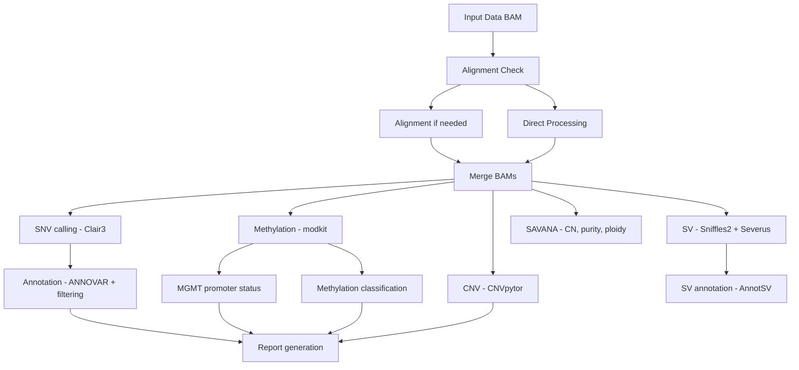

<div align="left">


<h1 style="display: inline-block;">Rapid-CNS<sup>2</sup> workflow</h1>
</div>

## Overview

The Rapid-CNS<sup>2</sup> nextflow pipeline is a bioinformatics workflow designed for comprehensive analysis of genomic and epigenomic data generated using adaptive sampling based sequencing of central nervous system (CNS) tumours. It performs tasks such as alignment, SNV calling, structural variant calling, methylation analysis, copy number variation calling, and provides a comprehensive molecular report.

This pipeline is implemented using Nextflow, allowing for easy execution and scalability on various compute environments, including local machines, clusters, and cloud platforms.

## Features

- **Modular architecture** for easy customization and extension
- **Flexible input handling** - supports aligned and unaligned BAM files with automatic alignment detection
- **SNV calling with Clair3**, with the model auto-detected from the BAM's basecaller
- **Structural variants from Sniffles2 and Severus**, both annotated with AnnotSV
- **Copy number from CNVpytor, plus SAVANA** for copy number, tumour purity and ploidy
- **Comprehensive analysis** including methylation analysis with Rapid-CNS² classifier and MGMT promoter methylation status
- **Automated reporting** with molecular diagnostic-ready reports
- **MNP-Flex integration** preparing input for upload to [app.epignostix.com](https://app.epignostix.com) (on by default)

## Requirements

- **Nextflow:** version 23.10.0 or later (enforced by `manifest.nextflowVersion`)
- **Container Engine:** Singularity/Apptainer (typical on HPC) or Docker
- **Java:** OpenJDK 8 or later
- **System:** Linux (Ubuntu 18.04+, CentOS 7+, or similar)
- **Memory:** Minimum 8GB RAM, recommended 32GB+ for large datasets
- **Storage:** At least 100GB free space for reference genomes and databases

## Quick start

### 1. Clone the repository
```bash
git clone https://github.com/areebapatel/Rapid-CNS2_nf.git
cd Rapid-CNS2_nf
```

### 2. Install dependencies

#### Install Nextflow
```bash
# Using Conda (recommended)
conda create -n nextflow python=3.9
conda activate nextflow
conda install -c bioconda nextflow

# Or manual installation
curl -s https://get.nextflow.io | bash
sudo mv nextflow /usr/local/bin/
```

#### Install container engine
```bash
# Docker (recommended)
curl -fsSL https://get.docker.com -o get-docker.sh
sudo sh get-docker.sh
sudo usermod -aG docker $USER

# Or Singularity
sudo apt-get update
sudo apt-get install -y singularity-container
```

### 3. Download reference genome
```bash
# Create reference directory
mkdir -p /path/to/references/hg38

# Download UCSC hg38 reference genome
wget https://hgdownload.soe.ucsc.edu/goldenPath/hg38/bigZips/hg38.fa.gz
gunzip hg38.fa.gz
mv hg38.fa /path/to/references/hg38/hg38.fa

# Create index files
samtools faidx /path/to/references/hg38/hg38.fa
```

### 4. Install ANNOVAR

ANNOVAR is required for variant annotation:

1. **Register and download:**
   - Visit [ANNOVAR Download Form](https://www.openbioinformatics.org/annovar/annovar_download_form.php)
   - Fill out the registration form with your institutional email
   - Download the package from the link sent to your email

2. **Install and setup:**
```bash
# Extract ANNOVAR
tar -xzf annovar.latest.tar.gz
cd annovar
chmod +x *.pl

# Create humandb directory and download databases
mkdir humandb/

# cytoBand is a UCSC track, so it is fetched WITHOUT -webfrom annovar.
# Using -webfrom annovar for it silently fails.
./annotate_variation.pl -buildver hg38 -downdb cytoBand humandb/

# The rest are hosted by ANNOVAR
./annotate_variation.pl -buildver hg38 -downdb -webfrom annovar refGene humandb/
./annotate_variation.pl -buildver hg38 -downdb -webfrom annovar clinvar_20240917 humandb/
./annotate_variation.pl -buildver hg38 -downdb -webfrom annovar avsnp151 humandb/
./annotate_variation.pl -buildver hg38 -downdb -webfrom annovar 1000g2015aug humandb/
```

The five databases above are the pipeline default (`params.annovarProtocol`) and
all download freely. `1000g2015aug` unpacks into per-population files, so the
`1000g2015aug_eur` protocol resolves to `hg38_EUR.sites.2015_08.txt`.

Optionally, if you have access to them, add these to **both**
`params.annovarProtocol` and `params.annovarOperation` (the two lists must stay
the same length):

```bash
# cosmic70 requires a COSMIC licence; dbnsfp is ~30-40 GB
./annotate_variation.pl -buildver hg38 -downdb -webfrom annovar dbnsfp47a humandb/
./annotate_variation.pl -buildver hg38 -downdb -webfrom annovar allofus humandb/
```

**Note:** ANNOVAR is freely available for personal, academic, and non-profit use only. Commercial users must purchase a license from [QIAGEN](https://digitalinsights.qiagen.com/).

### 5. Install AnnotSV

AnnotSV is required for structural variant annotation:

```bash
# Navigate to installation directory
cd /path/to/install/

# Clone AnnotSV repository
git clone https://github.com/lgmgeo/AnnotSV.git

# Navigate to AnnotSV directory
cd AnnotSV

# Install AnnotSV
make PREFIX=. install

# Install human annotations
make PREFIX=. install-human-annotation
```

**Note:** AnnotSV is distributed under the GNU General Public License v3.0. See the [AnnotSV repository](https://github.com/lgmgeo/AnnotSV) for details.

### 6. Configure the pipeline

Edit the `nextflow.config` file with your system-specific paths:

```groovy
params {
    // Update these paths to match your system
    ref = "/path/to/references/hg38/hg38.fa"
    annovarPath = "/path/to/annovar/"
    annovarDB = "/path/to/annovar/humandb/"
    annotsvAnnot = "/path/to/AnnotSV/Annotations_Human/"
}
```

### 7. Run the pipeline

#### Basic run
```bash
nextflow run main.nf \
    --input /data/sample.bam \
    --id SAMPLE001 \
    --outDir ./results \
    -profile lsf,singularity
```

#### Advanced run
```bash
nextflow run main.nf \
    --input /data/sample.bam \
    --id SAMPLE001 \
    --patient "John Doe" \
    --outDir ./results \
    --minimumMgmtCov 10 \
    --mnpFlex true \
    --runHumanVariation true \
    -profile slurm,singularity
```

## Methylation-Only Pipeline

For users who only need methylation analysis without SNV, CNV, or structural variant calling, we provide a dedicated methylation-only workflow that is faster and uses fewer computational resources.

### Features

The methylation-only pipeline (`methylationOnly.nf`) includes:
- **5mC methylation calling** using modkit
- **MGMT promoter methylation assessment** with coverage validation
- **Methylation-based tumor classification** using the Rapid-CNS² classifier
- **MNP-Flex preparation** (optional) for external classifier analysis
- **BAM processing** with automatic alignment detection and methylation tags validation

### Usage

#### Basic methylation analysis
```bash
nextflow run methylationOnly.nf \
    --input /data/sample.bam \
    --id SAMPLE001 \
    --ref /path/to/hg38.fa \
    --outDir ./methylation_results
```

#### With MNP-Flex preparation
```bash
nextflow run methylationOnly.nf \
    --input /data/sample.bam \
    --id SAMPLE001 \
    --ref /path/to/hg38.fa \
    --outDir ./methylation_results \
    --mnpFlex
```

#### Advanced configuration
```bash
nextflow run methylationOnly.nf \
    --input /data/sample.bam \
    --id SAMPLE001 \
    --ref /path/to/hg38.fa \
    --outDir ./methylation_results \
    --patient "John Doe" \
    --minimumMgmtCov 10 \
    --modkitThreads 64 \
    --methThreads 128 \
    --mgmtThreads 16 \
    --mnpFlex \
    -profile lsf,singularity
```

### Parameters

#### Required parameters
| Parameter | Description | Example |
|-----------|-------------|---------|
| `--input` | Path to input BAM file(s) | `--input /data/sample.bam` |
| `--id` | Sample identifier | `--id SAMPLE001` |
| `--ref` | Path to hg38 reference genome | `--ref /refs/hg38.fa` |
| `--outDir` | Output directory | `--outDir ./results` |

#### Optional parameters
| Parameter | Description | Default | Example |
|-----------|-------------|---------|---------|
| `--patient` | Patient name for reports | Uses `--id` | `--patient "John Doe"` |
| `--minimumMgmtCov` | Minimum coverage for MGMT analysis | `5` | `--minimumMgmtCov 10` |
| `--modkitThreads` | Threads for methylation calling | `32` | `--modkitThreads 64` |
| `--methThreads` | Threads for classification | `64` | `--methThreads 128` |
| `--mgmtThreads` | Threads for MGMT analysis | `8` | `--mgmtThreads 16` |
| `--mnpFlex` | Enable MNP-Flex preparation | `true` | `--mnpFlex false` |

#### Containers

Every container is version-pinned; none use `:latest`.

| Label | Image | Provides |
|-------|-------|----------|
| `rapid_cns` | `areebapatel/rapid_cns:3.0.0` | samtools, bedtools, vcftools, dorado, mosdepth, CNVpytor, Sniffles2, methylartist, igv-reports, AnnotSV (code), R stack |
| `mods` | `quay.io/biocontainers/ont-modkit:0.6.4--h7f49ad2_0` | modkit |
| `clair3` | `hkubal/clair3:v2.0.2` | Clair3 and its bundled ONT models |
| `severus` | `quay.io/biocontainers/severus:1.7--pyhdfd78af_0` | Severus |
| `savana` | `quay.io/biocontainers/savana:1.3.8--pyhdfd78af_0` | SAVANA |

The `rapid_cns` image is built from `dockerfiles/rapid_cns/Dockerfile`; see the
header of that file for the build command. It is amd64-only by design, because
dorado's Linux build and the mosdepth release binary are published for x86_64.

**AnnotSV annotations are not in the container.** They are ~6.6 GB, are released
independently of the AnnotSV code, and downloading them at build time would make
an otherwise-pinned image non-reproducible. Install them on the host (step 5
above) and point `--annotsvAnnot` at the directory *containing*
`Annotations_Human` - that is AnnotSV's `-annotationsDir`, usually
`<install>/share/AnnotSV`, **not** `Annotations_Human` itself.

## Output

The methylation-only pipeline generates outputs in the following directories:

```
output/
├── bam/                           # BAM processing outputs
│   └── alignedBams/              # Aligned BAM files (if alignment needed)
├── mods/                         # Methylation calls (bedmethyl files)
├── mgmt/                         # MGMT promoter analysis
│   ├── mgmt_avg_cov.txt         # Coverage summary
│   ├── SAMPLE001_mgmt.png       # MGMT promoter plot
│   └── SAMPLE001_mgmt_pred.txt  # MGMT prediction results
├── methylation_classification/   # Tumor classification results
└── mnpflex/                     # MNP-Flex compatible files (if --mnpFlex)
```

### When to use methylation-only

Use the methylation-only pipeline when you:
- Only need methylation analysis and tumor classification
- Want faster execution (skips computationally intensive variant calling)
- Have limited computational resources
- Are primarily interested in MGMT promoter methylation status
- Need MNP-Flex compatible files for external analysis

**Note:** The methylation-only pipeline uses the same BAM processing logic as the main pipeline, including automatic alignment detection and methylation tags validation.

## Input requirements

### Sequencing requirements

**⚠️ IMPORTANT: This pipeline is specifically designed for Oxford Nanopore Technologies (ONT) data generated using adaptive sampling with the gene panel described in Patel et al. 2022 and Patel et al. 2025.**

- **Platform:** Oxford Nanopore Technologies (MinION, GridION, PromethION)
- **Sequencing Method:** Adaptive sampling with targeted gene panel
- **Gene Panel:** NPHD panel (160 gene regions) as described in:
  - Patel et al. (2022). Rapid-CNS²: rapid comprehensive adaptive nanopore-sequencing of CNS tumors. *Acta Neuropathologica* 143, 609–612
  - Patel et al. (2025). Prospective, multicenter validation of a platform for rapid molecular profiling of central nervous system tumors. *Nature Medicine* 31, 1567–1577

**⚠️ NOT SUITABLE FOR:**
- Shallow whole genome sequencing (WGS)
- Other sequencing platforms (Illumina, PacBio, etc.)
- Non-targeted sequencing approaches

**⚠️ WGS WARNING:**
If using whole genome sequencing data, the average coverage should be at least **10X** for reliable reporting of variants. Lower coverage may result in:
- Reduced sensitivity for variant detection
- Increased false negative rates
- Unreliable methylation analysis
- Poor MGMT promoter methylation assessment

### Basecalling

**Basecalling must be performed externally.**
- Use [epi2me-labs/wf-basecalling](https://github.com/epi2me-labs/wf-basecalling) or Dorado directly
- Ensure you use a model that supports modified basecalling (see [Dorado documentation](https://github.com/nanoporetech/dorado?tab=readme-ov-file#modified-basecalling))
- Provide the resulting BAM(s) as input to this pipeline

#### Optional helper script

If you do not already have a modified-base BAM, `scr/basecall.sh` wraps Dorado
for one run/flow cell and writes a modBAM that can be passed straight to
`--input`. It is a convenience only and is not part of the pipeline.

```bash
# aligned modBAM, ready for the pipeline
scr/basecall.sh \
    --pod5 /data/run1/pod5 \
    --sample SAMPLE001 \
    --outdir /results/dorado \
    --ref /path/to/hg38.fa

# submit to LSF with 4 GPUs (adjust for your scheduler)
bsub -q gpu -n 16 -R "rusage[mem=96GB] span[hosts=1]" \
     -gpu num=4:j_exclusive=yes:gmem=16G \
     scr/basecall.sh --pod5 /data/run1/pod5 --sample SAMPLE001 \
                     --outdir /results/dorado --ref /path/to/hg38.fa
```

Defaults are the `hac` model with `5mCG_5hmCG` modified bases; pass `--model sup`
for the super-accurate model. Omitting `--ref` produces an unaligned modBAM,
which the pipeline will align itself. Large flow cells can exceed a scheduler
wall-clock limit, so the script is resume-capable: re-running the identical
command continues from where it stopped via Dorado's `--resume-from`, and the
final `<sample>.bam` only appears once Dorado exits cleanly. Run
`scr/basecall.sh --help` for all options.

### Input options

The pipeline accepts:
- **(Preferred) Single aligned BAM file:** Direct path to a single aligned and merged BAM file (e.g., `/path/to/sample.bam`)
- **Directory with aligned BAM files:** Path to directory containing multiple aligned BAM files (will be merged automatically)
- **Directory with unaligned BAM files:** Path to directory containing multiple unaligned BAM files (will be aligned and merged automatically)

## Pipeline structure


```mermaid
graph TD
    A[Input Data BAM] --> B[Alignment Check]
    B --> C[Alignment if needed]
    B --> D[Direct Processing]
    C --> E[Merge BAMs]
    D --> E
    E --> F[SNV calling - Clair3]
    E --> G[Methylation - modkit]
    E --> H[SV - Sniffles2 + Severus]
    E --> N[CNV - CNVpytor]
    E --> O[SAVANA - CN, purity, ploidy]
    F --> I[Annotation - ANNOVAR + filtering]
    G --> J[MGMT promoter status]
    G --> K[Methylation classification]
    H --> L[SV annotation - AnnotSV]
    I --> M[Report generation]
    J --> M
    K --> M
    N --> M
```

## Parameters

### Required parameters

| Parameter | Description | Example |
|-----------|-------------|---------|
| `--input` | **Required.** Path to input BAM file(s). Can be:<br>• Single aligned BAM file: `/path/to/sample.bam`<br>• Directory with aligned BAMs: `/path/to/aligned_bams/`<br>• Directory with unaligned BAMs: `/path/to/unaligned_bams/` | `--input /data/sample.bam` |
| `--id` | **Required.** Unique sample identifier used for naming output files and reports. Should be alphanumeric with no spaces. | `--id SAMPLE001` |

### System-specific parameters

**These parameters must be configured for your specific system and installation paths in the nextflow.config file:**

| Parameter | Description | Default | Example |
|-----------|-------------|---------|---------|
| `--ref` | Path to hg38 reference genome FASTA file | System-specific | `--ref /refs/hg38.fa` |
| `--annovarPath` | Path to ANNOVAR installation directory. | System-specific | `--annovarPath /tools/annovar/` |
| `--annovarDB` | Path to ANNOVAR database directory (humandb/). | System-specific | `--annovarDB /tools/annovar/humandb/` |
| `--annotsvAnnot` | Path to AnnotSV annotations directory. | System-specific | `--annotsvAnnot /tools/AnnotSV/Annotations_Human/` |
| `--annotations` | Path to annotation file for IGV reports (refGene.txt.gz). | `${projectDir}/data/refGene.txt.gz` | `--annotations /refs/refGene.txt.gz` |


### Optional parameters

#### Output parameters

| Parameter | Description | Default | Example |
|-----------|-------------|---------|---------|
| `--outDir` | Output directory for all pipeline results. Will be created if it doesn't exist. | `output` | `--outDir /results/analysis` |
| `--patient` | Patient name for reports. If not specified, uses the `--id` value. | `null` (uses `--id`) | `--patient "John Doe"` |

#### Resource parameters

| Parameter | Description | Default | Example |
|-----------|-------------|---------|---------|
| `--maxThreads` | Maximum number of threads for general processes. | `64` | `--maxThreads 32` |
| `--modkitThreads` | Number of threads for modkit methylation calling. | `32` | `--modkitThreads 16` |
| `--cnvThreads` | Number of threads for CNVpytor copy number analysis. | `32` | `--cnvThreads 16` |
| `--snifflesThreads` | Number of threads for Sniffles2 structural variant calling. | `32` | `--snifflesThreads 16` |
| `--snpThreads` | Number of threads for SNV calling with Clair3. | `64` | `--snpThreads 32` |
| `--svThreads` | Number of threads for structural variant calling. | `64` | `--svThreads 32` |
| `--covThreads` | Number of threads for coverage calculation with mosdepth. | `8` | `--covThreads 4` |
| `--methThreads` | Number of threads for methylation classification. | `64` | `--methThreads 32` |
| `--mgmtThreads` | Number of threads for MGMT promoter analysis. | `8` | `--mgmtThreads 4` |

#### Analysis parameters

| Parameter | Description | Default | Example |
|-----------|-------------|---------|---------|
| `--minimumMgmtCov` | Minimum coverage threshold for MGMT promoter methylation analysis. If coverage is below this threshold, MGMT analysis will be skipped. | `5` | `--minimumMgmtCov 10` |
| `--bamMinCoverage` | Minimum coverage threshold for human variation workflow. | `10` | `--bamMinCoverage 15` |
| `--mnpFlex` | Enable MNP-Flex classifier input preparation. Creates files needed for external MNP-Flex analysis. | `true` | `--mnpFlex false` |
| `--snifflesNonGermline` | Run Sniffles2 in somatic mode (`--non-germline`). Input is tumour-only, so this is on by default. | `true` | `--snifflesNonGermline false` |
| `--publishBam` | Publish the prepared full-flow-cell BAM. It is >150 GB and reproducible from the input, so it is not copied into the results by default. The panel subset BAM is always published. | `false` | `--publishBam true` |
| `--runHumanVariation` | Enable wf-human-variation SNP and SV pipeline. Adds additional variant calling workflows. | `false` | `--runHumanVariation true` |

#### Variant calling tool parameters

| Parameter | Description | Default | Example |
|-----------|-------------|---------|---------|
| `--clair3Model` | Clair3 model directory name. By default it is **auto-detected** from the `basecall_model=` field in the BAM's `@RG` header and validated against the models shipped in the container, so a mismatched model cannot be used silently. Set only to override. | `null` (auto) | `--clair3Model r1041_e82_400bps_sup_v500` |
| `--severusVntr` | Optional VNTR BED for Severus. Recommended: `vntrs/human_GRCh38_no_alt_analysis_set.trf.bed` from the [Severus repo](https://github.com/KolmogorovLab/Severus). | `null` | `--severusVntr /refs/vntr.bed` |
| `--severusPON` | Optional panel of normals for Severus. Without one, tumour-only Severus has **no somatic filter**, so supplying `pon/PoN_1000G_hg38.tsv.gz` is strongly advised. | `null` | `--severusPON /refs/PoN_1000G_hg38.tsv.gz` |
| `--savanaG1000` | 1000G het-SNP set used by SAVANA for B-allele frequency, purity and ploidy. | `1000g_hg38` | `--savanaG1000 1000g_hg38` |

#### Annotation parameters

| Parameter | Description | Default |
|-----------|-------------|---------|
| `--annovarProtocol` | Comma-separated ANNOVAR databases. | `refGene,cytoBand,clinvar_20240917,avsnp151,1000g2015aug_eur` |
| `--annovarOperation` | ANNOVAR operation codes. **Must have the same number of entries as `--annovarProtocol`** - the pipeline checks this at startup and fails early if not. | `gx,r,f,f,f` |

To add `cosmic70` (needs a COSMIC licence), `dbnsfp47a` or `allofus`, append to
**both** lists, keeping them the same length.

#### Container and system parameters

| Parameter | Description | Default | Example |
|-----------|-------------|---------|---------|
| `--containerBindPaths` | Comma-separated host paths to bind into containers. Singularity only auto-mounts the work directory, so reference genome, ANNOVAR and AnnotSV paths outside it **must** be listed here or they will be invisible inside the container. | `/b06x-isilon,/omics` | `--containerBindPaths /data,/refs` |
| `--seq` | Sequencer platform identifier. Set to `false` to auto-detect from the BAM header. | `P2S` | `--seq F` |

### Profile-specific parameters

The pipeline supports different compute infrastructure profiles:

No GPU is required. Clair3 replaced Parabricks DeepVariant, so the pipeline runs
entirely on CPU.

Resources are set with native Nextflow `cpus`/`memory`/`queue` directives rather
than hand-written `clusterOptions`, which previously emitted duplicate `-n` and
`-q` flags on every submission.

#### LSF profile (`-profile lsf`)
- **Executor:** LSF, queue `verylong`, `perJobMemLimit` enabled
- **Default:** 2 CPUs / 8 GB

| Label | Processes | CPUs | Memory |
|-------|-----------|------|--------|
| `rapid_cns` | BAM prep, coverage, CNVpytor, Sniffles2, AnnotSV, reporting | 8 | 32 GB |
| `mods` | modkit methylation calling | 32 | 32 GB |
| `clair3` | SNV calling | 32 | 64 GB |
| `severus` | Severus SV calling | 16 | 64 GB |
| `savana` | SAVANA SV and copy number | 16 | 64 GB |

#### SLURM profile (`-profile slurm`)
- **Executor:** SLURM, queue `batch`; same per-label CPU/memory table as LSF.

#### Local profile (`-profile local`)
- **Executor:** Local, 1 CPU / 4 GB per process. Suitable only for small tests.

## Output

```
output/
├── bam/                    # merged, sorted, indexed BAM + panel subset
├── snv/                    # Clair3 VCF, PASS VCF, ANNOVAR multianno, filtered report
├── sv/
│   ├── <id>.sniffles2.vcf              # Sniffles2 calls
│   ├── <id>_sniffles_annotsv.tsv       # AnnotSV annotation
│   ├── severus/                        # Severus calls + <id>.severus.vcf
│   ├── <id>_severus_annotsv.tsv        # AnnotSV annotation
│   └── savana/                         # SAVANA tumour-only breakpoints
├── cnv/
│   ├── <id>.cnvpytor.calls.*.tsv       # CNVpytor calls at 1k/10k/100k bins
│   ├── <id>_cnvpytor_100k.png/.pdf     # genome-wide plot
│   ├── <id>.annotation.1000.xlsx       # gene-level CNV table
│   └── savana/                         # SAVANA copy number + purity/ploidy fit
├── mods/                   # modkit bedMethyl
├── mgmt/                   # MGMT coverage, status, methylartist plot
├── methylation_classification/         # votes, rf_details, calibrated scores
├── mnpflex/                # <id>.MNPFlex.input.bed  (upload to app.epignostix.com)
├── coverage/               # mosdepth summaries
├── reports/                # IGV report
├── report/                 # final HTML + PDF reports
└── pipeline_info/          # timeline, trace, execution report
```

> **Note on the report:** the final HTML/PDF currently covers coverage, SNVs,
> the IGV report, the CNVpytor copy-number plot, methylation classification and
> MGMT. The Sniffles2/Severus/AnnotSV results, the SAVANA copy-number and
> purity/ploidy output and the gene-level CNV table are written to disk but are
> **not yet included in the rendered report**.

### MNP-Flex integration

**MNP-Flex** is a methylation-based tumor classifier that provides detailed molecular classification of CNS tumours. The Rapid-CNS² pipeline can prepare the necessary input files for MNP-Flex analysis.

#### What is MNP-Flex?

MNP-Flex is a methylation classifier compatible with the latest version of the Heidelberg CNS tumour methylation classifier. It can classify CNS tumours into 184 subclasses according to the 2021 WHO classification.

#### How to use MNP-Flex

1. **Enable MNP-Flex in the pipeline:**
   ```bash
   nextflow run main.nf \
       --input /data/sample.bam \
       --id SAMPLE001 \
       --mnpFlex true \
       -profile lsf,singularity
   ```

2. **Locate the output files:**
   The pipeline creates MNP-Flex compatible files in:
   ```
   ${outDir}/mnpflex/
   └── ${id}.MNPFlex.input.bed
   ```

3. **Upload to MNP-Flex:**
   - Visit [app.epignostix.com](https://app.epignostix.com)
   - Upload the `.bed` file generated by the pipeline
   - Submit for analysis

4. **Interpret results:**
   - MNP-Flex will provide detailed classification results
   - Results include confidence scores
   - Reports are compatible with clinical interpretation guidelines

#### Output files

- **`${id}.MNPFlex.input.bed`:** Methylation data in MNP-Flex compatible format

**Note:** MNP-Flex analysis is performed externally at [app.epignostix.com](https://app.epignostix.com). The pipeline only prepares the input file; it does not upload anything.

### Getting Help

- Check the Nextflow documentation: https://www.nextflow.io/docs/
- Review the pipeline logs in the `work/` directory
- Check the `pipeline_info/` directory for execution reports
- Run with `--help` for available options

## Citation

If you use this pipeline, please cite our work:

Patel, A., Göbel, K., Ille, S. et al. Prospective, multicenter validation of a platform for rapid molecular profiling of central nervous system tumors. *Nature Medicine* 31, 1567–1577 (2025). [https://doi.org/10.1038/s41591-025-03562-5](https://www.nature.com/articles/s41591-025-03562-5)

## License

This project is licensed under the [Apache License 2.0](LICENSE).

[](LICENSE)
[](https://www.nextflow.io/)